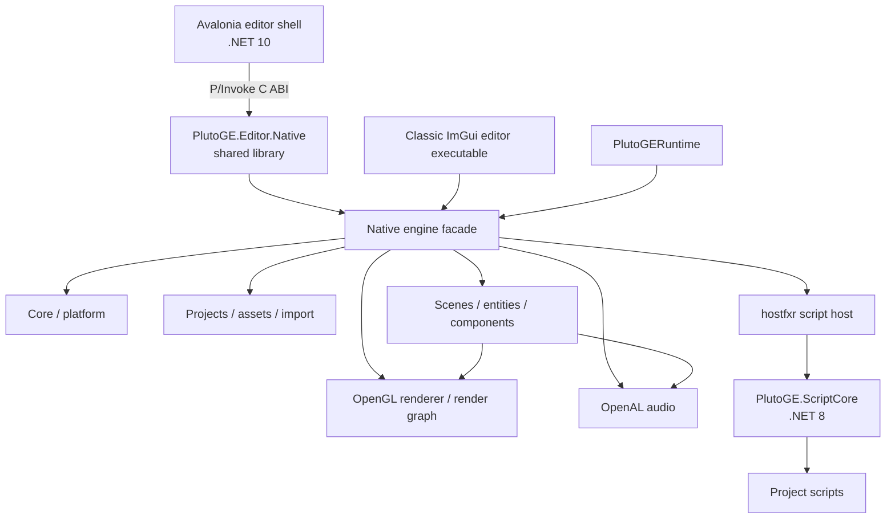

# PlutoGE

PlutoGE is an in-development 3D game engine and editor built around a C++20 native core, an OpenGL renderer, an Avalonia desktop shell, and .NET 8 gameplay scripting. It includes scene and prefab authoring, model and asset import, physics, audio, animation, particles, terrain and foliage tools, runtime UI, post-processing, and a cooked Windows export pipeline.

> [!IMPORTANT]
> PlutoGE is under active development. Project and asset formats, editor workflows, and public APIs may change. The main build and shipping workflow is currently Windows-focused.

## Contents

- [Highlights](#highlights)
- [Technology](#technology)
- [Quick start](#quick-start)
- [Using the editor](#using-the-editor)
- [Projects and assets](#projects-and-assets)
- [C# scripting](#c-scripting)
- [Building from the command line](#building-from-the-command-line)
- [Testing](#testing)
- [Exporting a game](#exporting-a-game)
- [Architecture](#architecture)
- [Repository layout](#repository-layout)
- [Troubleshooting](#troubleshooting)
- [Project status and contributing](#project-status-and-contributing)

## Highlights

### Editor and authoring

- Avalonia desktop shell hosting the native editor and renderer.
- Dockable scene, game, hierarchy, inspector, content browser, console, profiler, material, mesh, animation, particle, and graph-editing views.
- Hierarchical scenes with copy, paste, duplicate, delete, parenting, prefabs, undo, and redo.
- Transform gizmos with local/world modes, snapping, selection framing, and debug render views.
- Unity-style scene navigation: `Alt+LMB` orbit, `MMB` pan, `RMB` fly, mouse wheel zoom, and `F` to frame the selected entity.
- Play-in-editor with a pre-play scene snapshot that is restored when runtime play stops.
- Scene baking presets and editor/runtime profiling.

### Rendering and world building

- OpenGL deferred rendering with geometry, lighting, shadow, transparency, particles, ocean, physical sky, volumetric cloud, runtime UI, and post-process passes.
- Materials and node-based shader graphs.
- Post-processing effects including auto exposure, bloom, color grading, depth of field, FXAA, gamma correction, lens flare, motion blur, SSAO, SSGI, SSR, TAA, tone mapping, volumetric fog, and experimental indirect-lighting techniques.
- Terrain, foliage painting and per-instance editing, splines, oceans/lakes, physical sky, volumetric clouds, and IBL capture components.
- Texture painting and mesh LOD generation/optimization.

### Gameplay systems

- Entity/component scenes and reusable prefabs.
- Bullet-based rigid bodies, colliders, raycasts, navigation meshes, and navigation agents.
- Skeletal animation, animation clips, state-machine animation graphs, skeleton attachments, and animation events.
- OpenAL Soft audio with emitters, listeners, 3D spatialization, and obstruction support.
- Configurable particle systems with trails, collision behavior, local/world simulation, and sub-emitters.
- Runtime canvas, rect transform, image, text, and button components.
- C# scripting with serialized editor fields, lifecycle callbacks, component wrappers, input, physics, scene loading, prefabs, scriptable objects, audio, animation, particles, and UI.

### Content pipeline

- Imports glTF (`.gltf`, `.glb`) and FBX models, extracting discrete mesh, material, texture, and animation assets.
- Recognizes common texture formats (`.png`, `.jpg`, `.jpeg`, `.tga`, `.hdr`, `.exr`) and WAV audio.
- Uses stable `project://` references for project content and `engine://` references for built-in resources.
- Exports a game as a self-contained folder with the native runtime, cooked `.plutopack` content, native dependencies, and a bundled .NET runtime.

## Technology

| Area | Implementation |
|---|---|
| Native language | C++20, with C used for bundled GLAD |
| Build system | CMake and CMake Presets |
| Editor shell | C# / Avalonia 12 on .NET 10 |
| Embedded editor UI | Dear ImGui docking and ImGuizmo |
| Rendering | OpenGL via GLAD and GLFW; GLM math |
| Physics | Bullet 3 |
| Audio | OpenAL Soft |
| Model import | Assimp, tinygltf, and meshoptimizer |
| Gameplay scripting | C# on .NET 8, hosted in-process through `hostfxr` |
| Tests | CTest native executables and a .NET viewport validation executable |

Most third-party native dependencies are downloaded by CMake through `FetchContent`. The first configure therefore needs internet access and can take noticeably longer than later builds.

## Quick start

The supported one-command development path is Windows with Visual Studio 2022.

### Prerequisites

- Windows 10 or 11, 64-bit.
- [Visual Studio 2022](https://visualstudio.microsoft.com/vs/) with **Desktop development with C++** and the Windows SDK.
- [CMake](https://cmake.org/download/) on `PATH`. CMake 3.28 or newer is recommended and is required to consume the version-8 preset file.
- [.NET 10 SDK](https://dotnet.microsoft.com/download/dotnet/10.0) on `PATH` for the Avalonia editor.
- .NET 8 targeting support for gameplay script projects.
- Git and internet access during the initial dependency fetch.

Confirm the primary tools are visible:

```powershell
cmake --version
dotnet --version
git --version
```

### Clone, build, and launch

```powershell
git clone https://github.com/CameronAirlie/PlutoGE.git
cd PlutoGE
.\run-editor.cmd
```

On its first run, the launcher configures `out/build/editor`, downloads native dependencies, builds `PlutoGE.Editor.Native`, builds the Avalonia application, and starts the editor. Later runs reuse the same build tree.

Useful launcher options:

```powershell
# Compile without launching.
.\run-editor.cmd -BuildOnly

# Rerun CMake configuration before building.
.\run-editor.cmd -Reconfigure

# Build the optimized editor configuration.
.\run-editor.cmd -Configuration Release

# Launch the editor's viewport validation mode.
.\run-editor.cmd -ViewportValidation
```

Close every running PlutoGE editor window before rebuilding; Windows cannot replace the loaded native bridge DLL while the process is open.

## Using the editor

### Create a project

1. Launch the editor and choose **File > New Project**.
2. Select a path ending in `.plutoproject`.
3. Save the initial scene and configure the startup scene in **Project Settings**.
4. Add content through the Content Browser or drag supported models into it.
5. Add entities and components from the Hierarchy and Inspector.
6. Press `F5` or choose **Runtime > Play** to test the scene. Use `Shift+F5` to stop.

A new source project starts with this shape and gains the scripting directories when the editor prepares its build scaffold:

```text
MyGame/
├── MyGame.plutoproject
├── MyGame.Scripts.csproj
└── Assets/
    ├── Managed/            # compiled script assembly and runtime metadata
    ├── Materials/
    ├── Meshes/
    ├── Scenes/
    │   └── Main.plutoscene
    └── Scripts/            # user-authored .cs files
```

The editor maintains the project manifest and asset registry. Prefer moving and creating assets through the editor so references and generated metadata remain consistent.

### Common controls

| Action | Control |
|---|---|
| Play | `F5` |
| Stop | `Shift+F5` |
| Translate / rotate / scale gizmo | `W` / `E` / `R` |
| Frame selected | `F` |
| Fly camera | Hold `RMB`; use movement keys |
| Orbit selection/pivot | `Alt+LMB` |
| Pan | `MMB` |
| Dolly/zoom | Mouse wheel |
| Copy / paste / duplicate | `Ctrl+C` / `Ctrl+V` / `Ctrl+D` |
| Delete selected | `Delete` |
| Undo / redo | `Ctrl+Z` / `Ctrl+Y` |
| Force editor cursor visible during play | `Shift+F1` |

## Projects and assets

### Project manifest

The `.plutoproject` file is a tab-delimited manifest containing the project name, asset root, startup scene, script assembly, window settings, VSync choice, editor camera state, editor post-processing settings, and refreshed asset registry. A runtime opens the startup scene and chooses the active main camera, falling back to the first enabled scene camera.

Project-relative resources use references such as:

```text
project://Scenes/Main.plutoscene
project://Materials/Stone.plutomaterial
```

Built-in meshes, materials, and shader graphs use `engine://` references, for example:

```text
engine://builtin/mesh/cube
engine://builtin/material/default-shaded
engine://builtin/shadergraph/default-lit
```

### Native asset types

| Extension | Purpose |
|---|---|
| `.plutoproject` | Project manifest and asset registry |
| `.plutoscene` | Serialized entity/component scene |
| `.plutoprefab` | Reusable serialized entity hierarchy |
| `.plutomesh` | Imported/processed mesh and LOD data |
| `.plutomaterial` | Material settings and texture bindings |
| `.plutoshadergraph` | Node-based shader graph |
| `.plutoanim` | Imported animation asset |
| `.plutoclip` | Animation clip definition |
| `.plutoanimgraph` | Animation state machine |
| `.plutoparticles` | Particle-system asset |
| `.plutopostprocess` | Reusable post-process stack |
| `.plutoscriptable` | Serialized C# `ScriptableObject` data |
| `.plutopack` | Cooked standalone-game content container |
| `.plutometa`, `.plutomodel` | Generated import metadata; not normal registry entries |

The content browser also indexes source scripts/assemblies, models, textures, and WAV files. Model import currently supports glTF/GLB and FBX through the editor workflow; `.obj` files are also recognized as mesh references by the asset system.

### Components

Scenes can serialize components across these broad groups:

- **Rendering:** mesh, camera, lights, IBL capture, physical sky, volumetric clouds, terrain, foliage, ocean, particles, and skeleton attachments.
- **Animation:** skeleton animation and graph-driven animation state.
- **Physics and navigation:** rigid body, box/sphere/capsule collider, cloth, spline collision, navigation mesh, and navigation agent.
- **Audio:** sound emitter and sound listener.
- **Scripting:** one or more managed script instances with reflected serialized members.
- **Runtime UI:** canvas, rect transform, image, text, and button.

## C# scripting

Gameplay scripts target .NET 8 and reference `PlutoGE.ScriptCore`. The editor creates `<ProjectName>.Scripts.csproj`, compiles all files under `Assets/Scripts`, writes the result to `Assets/Managed`, and reloads it after a successful build.

An attachable script is a non-abstract `ScriptBehaviour` with a parameterless constructor:

```csharp
using System.Numerics;
using PlutoGE.ScriptCore;

public sealed class MovingPlatform : ScriptBehaviour
{
    [SerializedField] private float speed = 2.0f;
    [SerializedField] private Vector3 direction = Vector3.UnitX;
    [SerializedField] private GameObject? target;

    public override void OnCreate()
    {
        Debug.Log($"Created {GameObject.Name}");
    }

    public override void OnUpdate(float deltaTime)
    {
        GameObject.Position += direction * speed * deltaTime;

        if (target is not null && Input.IsKeyPressed(KeyCode.Space))
            target.Active = !target.Active;
    }
}
```

Use `[SerializedField]` on supported fields or properties that must appear in the Inspector and persist in scenes or prefabs. Serialized values are applied before `OnCreate`. Engine references are nullable, so check results from object lookup, component access, prefab creation, and raycasts.

The managed API includes:

- `OnCreate`, `OnUpdate`, `OnLateUpdate`, and collision enter/exit callbacks.
- Local/world transforms, tags, entity lookup and destruction, and cross-script invocation.
- Typed wrappers for render, camera, lighting, physics, animation, particles, audio, and UI components.
- Keyboard, mouse, cursor-lock, and quit input.
- Raycasts and collision-aware kinematic movement.
- Prefab instantiation and asynchronous scene-change requests.
- Scriptable-object data assets and debug logging.

See [the complete C# scripting specification](docs/CSHARP_SCRIPTING.md) for supported serialized types, every wrapper, examples, limitations, and the public API contract. Example behaviours are under [`engine/scripting/managed/PlutoGE.ScriptCore/Examples`](engine/scripting/managed/PlutoGE.ScriptCore/Examples).

## Building from the command line

### Primary editor build

The launcher is a wrapper around the following CMake workflow:

```powershell
cmake -S . -B out/build/editor -A x64 `
  -DPLUTO_BUILD_EDITOR=ON `
  -DPLUTO_BUILD_RUNTIME=OFF `
  -DPLUTO_BUILD_SAMPLES=OFF `
  -DBUILD_TESTING=OFF

cmake --build out/build/editor `
  --config Debug `
  --target PlutoGEAvaloniaEditor `
  --parallel
```

The final Avalonia editor is emitted under:

```text
editor/avalonia/bin/Debug/net10.0/
```

`PlutoGEAvaloniaEditor` first builds the shared native bridge, then invokes `dotnet build` and copies `PlutoGE.Editor.Native.dll` and OpenAL beside the managed editor.

### Presets

The repository provides these configure presets:

| Preset | Intended use |
|---|---|
| `msvc` | Visual Studio 2022 x64, with normal editor/runtime/test options |
| `msvc-shipping` | Release-only Windows runtime used for final exports |
| `gcc` | Debug build using the hard-coded `C:/w64devkit/bin` MinGW toolchain |

Example full MSVC build:

```powershell
cmake --preset msvc
cmake --build --preset msvc-debug --parallel
```

Example MinGW build, after installing w64devkit at the path recorded in `CMakePresets.json`:

```powershell
cmake --preset gcc
cmake --build --preset gcc --parallel
```

### Build options

| Option | Default | Meaning |
|---|---:|---|
| `PLUTO_BUILD_EDITOR` | `ON` | Build editor targets |
| `PLUTO_BUILD_RUNTIME` | `ON` | Build the standalone runtime |
| `PLUTO_BUILD_SAMPLES` | `ON` | Reserved for sample targets; samples are not currently added at the root |
| `BUILD_TESTING` | `ON` | Add CTest targets through `include(CTest)` |

The native CMake graph also exposes a classic `PlutoGEEditor` executable. The recommended day-to-day entry point is the Avalonia application built by `PlutoGEAvaloniaEditor`.

## Testing

Configure and build a test-enabled tree, then run CTest:

```powershell
cmake --preset msvc
cmake --build out/build/msvc --config Debug --parallel
ctest --test-dir out/build/msvc -C Debug --output-on-failure
```

The registered suite currently covers:

- large-mesh optimization;
- model asset behavior;
- post-process initialization;
- Avalonia viewport navigation, camera state, resize handling, and 60/120/144 Hz cadence calculations.

The managed validation can also be run directly:

```powershell
dotnet run --project editor/avalonia/tests/PlutoGE.Editor.Avalonia.Validation.csproj --configuration Debug
```

For a build-and-launch smoke path, use:

```powershell
.\run-editor.cmd -ViewportValidation
```

## Exporting a game

The shipping helper configures a release-only MSVC runtime, builds a neighbouring `*.Scripts.csproj` in Release when present, cooks the project, and assembles the distributable folder:

```powershell
.\tools\Export-Game.ps1 `
  "C:\Projects\MyGame\MyGame.plutoproject" `
  "C:\Builds\MyGame\MyGame.exe"
```

The output folder contains the renamed game executable, one matching `.plutopack`, native dependencies, and a bundled .NET runtime. Source assets and C# source files are not shipped. Distribute the entire folder, not only the `.exe`.

If a shipping runtime has already been built, export directly with:

```powershell
.\out\build\msvc-shipping\runtime\Release\PlutoGERuntime.exe `
  --export <project.plutoproject> <output.exe>
```

The pack reduces loose-file overhead and discourages casual inspection, but its byte obfuscation is not cryptographic copy protection. See [EXPORTING.md](EXPORTING.md) for the concise export reference.

## Architecture



### Native modules

- **Core** owns engine startup, subsystem lifetimes, frame updates, and runtime play state.
- **Platform** provides the GLFW window, graphics context, and native input state.
- **Render** owns OpenGL resources, cameras, render targets, meshes, materials, shader graphs, render passes, post-processing, and editor debug rendering.
- **Assets** owns `.plutoproject` loading/saving, the registry, asset references, caching, content cooking, and standalone export assembly.
- **Import** turns source models into engine meshes, materials, textures, animations, and optimized LODs.
- **Scene** owns entities, transforms, component storage, serialization, prefabs, physics, navigation, runtime UI, and scene-level systems.
- **Audio** owns OpenAL devices, sources, listeners, clips, spatialization, and obstruction behavior.
- **Scripting** builds script projects and hosts CoreCLR through `hostfxr`, exposing native engine operations to `PlutoGE.ScriptCore`.

### Editor boundary

The Avalonia process owns desktop window composition and workspace panels. It calls the exported C ABI in `editor/native`, which owns an in-process native engine instance and the embedded ImGui/editor viewport. This boundary keeps the engine and renderer in native code while allowing the outer editor shell to use managed desktop UI.

The standalone runtime uses the same engine libraries without editor targets. During shipping export it also acts as the content cooker and bundle assembler.

## Repository layout

```text
PlutoGE/
├── CMakeLists.txt             # root options and module graph
├── CMakePresets.json          # MSVC, shipping, and MinGW configurations
├── run-editor.cmd             # primary Windows build/launch entry point
├── docs/                      # focused user/developer documentation
├── editor/
│   ├── avalonia/              # .NET 10 desktop shell and validation project
│   ├── native/                # C ABI bridge used by Avalonia
│   ├── resources/             # editor fonts/resources
│   └── ui/                    # native ImGui panels and editor orchestration
├── engine/
│   ├── assets/                # projects, registry, asset loading, cooking/export
│   ├── audio/                 # OpenAL-backed audio system
│   ├── core/                  # engine lifecycle
│   ├── import/                # glTF/FBX model import and optimization
│   ├── platform/              # window and input abstraction
│   ├── render/                # renderer, passes, effects, shaders, GPU resources
│   ├── scene/                 # ECS-style scene graph, components, serialization
│   └── scripting/             # native host and managed ScriptCore API
├── runtime/                   # standalone runtime and export CLI
├── tests/                     # native CTest targets
├── third_party/               # GLAD plus FetchContent dependency definitions
├── tools/                     # editor and shipping PowerShell automation
└── out/                       # generated build/install trees; ignored by Git
```

Public native headers follow `engine/<module>/include/PlutoGE/<module>`, while implementation files live under the matching `src` directory. CMake target aliases use the `PlutoGE::` namespace.

## Troubleshooting

### CMake cannot download dependencies

The initial configure clones GLFW, GLM, stb, ImGui, ImGuizmo, tinygltf, Assimp, meshoptimizer, OpenAL Soft, and Bullet. Check network/proxy access to GitHub, then rerun with `-Reconfigure` if the dependency cache is incomplete.

### `PlutoGEAvaloniaEditor` does not exist

CMake only creates this target when it can find `dotnet`. Install the .NET 10 SDK, open a fresh terminal, confirm `dotnet --version`, and run:

```powershell
.\run-editor.cmd -Reconfigure
```

### The native editor DLL cannot be copied

Close `PlutoGE.Editor.Avalonia.exe` before rebuilding. The launcher detects the common case and stops early with an explanatory message.

### CMake selects the wrong Visual Studio architecture

Delete only the dedicated editor build directory or use a fresh one, then configure with `-A x64`. Do not reuse a CMake cache created by a different generator or architecture.

### C# scripts do not appear or reload

- Keep scripts under the project's `Assets/Scripts` directory.
- Derive attachable classes from `ScriptBehaviour` and provide a parameterless constructor.
- Choose **Scripts > Build Scripts** and inspect the Console for compiler output.
- Confirm the project uses .NET 8 and the compiled assembly exists in `Assets/Managed`.
- Open the source project rather than an exported runtime bundle; exported bundles intentionally disable script authoring.

### An exported game starts without the intended view

Set a valid startup scene in Project Settings, ensure the scene is saved, and mark one enabled camera as the main camera. The runtime falls back to the first enabled camera, but a scene with no enabled camera cannot render a normal game view.

### Runtime diagnostics

On Windows, a standalone game writes `PlutoGERuntime.log` beside its executable. Use it to inspect startup phases, content loading, scene/camera selection, asset paths, and unhandled native exception information.

## Project status and contributing

The checked tasks and remaining experiments are tracked in [TODO.md](TODO.md). Useful focused references include:

- [C# scripting specification](docs/CSHARP_SCRIPTING.md)
- [Shipping/export guide](EXPORTING.md)
- [Managed ScriptCore notes](engine/scripting/README.md)

When changing the engine:

1. Keep public headers inside the module's `include/PlutoGE/...` tree.
2. Add sources and target dependencies to the nearest module `CMakeLists.txt`.
3. Add or update a native CTest or managed validation for behavior that can regress.
4. Build the `PlutoGEAvaloniaEditor` target and exercise the affected editor/runtime workflow.
5. Run the full CTest suite before submitting a change.

No root license file is currently included. Clarify reuse and redistribution terms with the repository owner before incorporating PlutoGE into another project.
